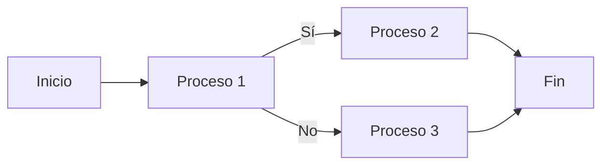

# 🏗️ Estructura de programa
A partir de este punto comenzaremos a ver temas que se pueden considerar como programación, aun que ya antes se han visto algunos bloques de codigo que ya se les puede considerar como programació. Expandiremos nuestro dominio del lenguaje JavaScript más allá de los sustantivos y fragmentos de oraciones que hemos visto hasta ahora, al punto donde podemos expresar prosa significativa.
