# 🏗️ Estructura de programa
A partir de este punto comenzaremos a ver temas que se pueden considerar como programación, aun que ya antes se han visto algunos bloques de codigo que ya se les puede considerar como programació. Expandiremos nuestro dominio del lenguaje JavaScript más allá de los sustantivos y fragmentos de oraciones que hemos visto hasta ahora, al punto donde podemos expresar prosa significativa.

### Diagrama de flujo para resolver problemas

```mermaid
graph TD;
    A[Funciona?];
    A -- Sí --> C[No le muevas];
    A -- No --> D[Le moviste algo?];
    C --> E[No hay problema];
    D -- Sí --> F[Ay diosito!];
    D -- No --> G[Crees que<br/>haya problema?];
    F --> H[Sabe alguien<br/>que le moviste?];
    H -- Sí --> I[Ni modo<br/>que hacer];
    H -- No --> J[Hazte menso];
    J --> E;
    I --> K[Le puedes echar<br/>la culpa a alguien?];
    K -- Sí --> E;
    K -- No --> I;
    G -- Sí --> I;
    G -- No --> L[Olvidalo];
    L --> E;
```

El anterior diagrama esta basado en la siguiente [imagen](https://pin.it/5Bj50eS). Como dato, los diagramas de flujo se hacen para representar de forma grafica la Estructura del programa, para mas información de los diagramas de flujo [aqui](https://es.wikipedia.org/wiki/Diagrama_de_flujo).
